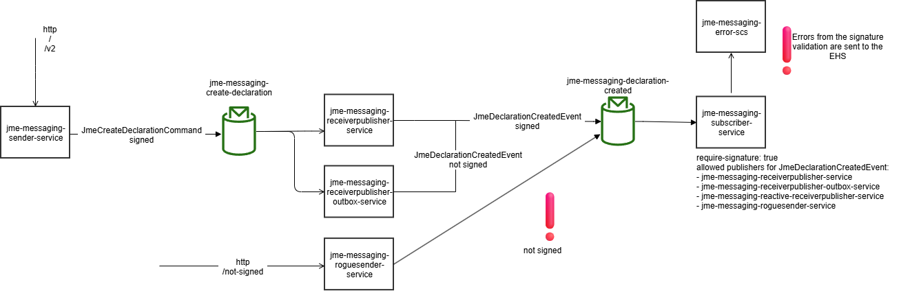

# JME Messaging Example

This example shows how to use the jEAP Messaging Library with Kafka for publishing/subscribing to events and for
sending/receiving commands. The example consists of the following modules:

* *jme-messaging-sender-service* sends commands
* *jme-messaging-receiverpublisher-service* receives those commands and publishes events
* *jme-messaging-receiverpublisher-outbox-service* is the same as *jme-messaging-receiverpublisher-service* but
  publishes events using the transactional outbox and gives an example for the application of the
  @IdempotentMessageHandler annotation
* *jme-messaging-subscriber-service* subscribes to those events and stores them locally
* *jme-messaging-error-scs* handles errors if an event or command couldn't be processed
* *jme-messaging-self-messaging-service* shows how a message type can be evolved for a microservice that sends
  messages to itself
* *jme-messaging-auth-scs* authenticates users to access the UI of jme-messaging-error-scs
* *jme-messaging-sequential-inbox-service* demonstrates the sequential inbox

To test the error-handling in error-handler, the following services can be used:
* *jme-messaging-roguesender-service* sends events directly to the error topic
* *jme-messaging-error-scs* handles these errors and publishes events to the DLT
* *jme-messaging-dltsubscriber-service* subscribes to those events in the DLT

Additionally, the module *jme-messaging-common-lib* is a library implementing the events and commands. It is used
by the sender, receiverpublisher, receiverpublisher-outbox and subscriber services.

This example project shows how to use the [jeap-messaging](https://github.com/jeap-admin-ch/jeap-messaging) library.

This repository is platform-agnostic: it contains the example services and their shared library, and publishes
them as Maven artifacts that platform-specific (non-public) deployments build on top of.

## Changes

This library is versioned using [Semantic Versioning](http://semver.org/) and all changes are documented in
[CHANGELOG.md](./CHANGELOG.md) following the format defined in [Keep a Changelog](http://keepachangelog.com/).

## Prerequisites

To use this project, ensure you have the following installed:

1. **Java Development Kit (JDK)**: Version 25.
2. **Docker**: For running the required infrastructure.

**Note:** Use the provided maven wrapper to build and run the project.

## Getting started

### Infrastructure

Before the examples can be started, the infrastructure (Kafka and PostgreSQL) has to be started using docker:

```shell
docker compose -f docker/docker-compose.yml up
```

### Build

The project itself can be built with a simple

```shell
./mvnw install
```

### Start

Then the individual services can be started using, e.g.:

```shell
./mvnw --projects jme-messaging-sender-service spring-boot:run -Dspring-boot.run.profiles=local
```

Only start one of the two services jme-messaging-receiverpublisher-service and
jme-messaging-receiverpublisher-outbox-service.

* You can trigger the sender to send a command by accessing http://localhost:8070/jme-messaging-sender-service/?text=testing&idempotenceId=1234
* You can check the subscriber for newly received events by accessing http://localhost:8074/jme-messaging-subscriber-service/events

To trigger an event processing exception at the subscriber, the following links can be used:
* http://localhost:8070/jme-messaging-sender-service/?text=npe&idempotenceId=123 triggers a NullPointerException
* http://localhost:8070/jme-messaging-sender-service/?text=fail&idempotenceId=123 triggers a permanent failure
* http://localhost:8070/jme-messaging-sender-service/?text=temp&idempotenceId=123 triggers a temporary failure with 66% probability
* http://localhost:8070/jme-messaging-sender-service/?text=temp100&idempotenceId=123 triggers a temporary failure

To trigger the outbox, the following link can be used:
http://localhost:8079/jme-messaging-receiverpublisher-outbox-service/swagger-ui/index.html?configUrl=/jme-messaging-receiverpublisher-outbox-service/api-docs/swagger-config

You can check the resulting errors by accessing the error service UI at http://localhost:8072/error-handling
(start jme-messaging-auth-scs and jme-messaging-error-scs first, see "Testing Error-SCS" below).

#### Special notes for the jme-messaging-receiverpublisher-outbox-service

If you started the jme-messaging-receiverpublisher-**outbox**-service you can also create a declaration and
trigger a JmeDeclarationCreatedEvent with a POST request to the following URL specifying the declaration text in
the request body:

* http://localhost:8079/jme-messaging-receiverpublisher-outbox-service/declaration

(Hint: use swagger (/jme-messaging-receiverpublisher-outbox-service/swagger-ui.html) or curl)

If the declaration text starts with *scheduled* the JmeDeclarationCreatedEvent will be sent asynchronously after
the transaction that created the declaration completed. If the declaration text is *RuntimeException* this will
cause a runtime exception after the JmeDeclarationCreatedEvent has been put into the transactional outbox and no
declaration will be created and no JmeDeclarationCreatedEvent will be sent. If the declaration text starts with
*failed* the message will be sent to a badly named topic which will cause Kafka to reject the message and will
result in a failed message, i.e. a message in state 'failed'. In all other cases the JmeDeclarationCreatedEvent
will be sent synchronously after the transaction that created the declaration completed.

You can check the declarations that have been created during the current day as well as the messages that have
been put into the transactional outbox during the current day by accessing the following URLs:

* http://localhost:8079/jme-messaging-receiverpublisher-outbox-service/inspect/declaration
* http://localhost:8079/jme-messaging-receiverpublisher-outbox-service/inspect/outbox

With its *FailedMessagesController* the jme-messaging-receiverpublisher-outbox-service also gives an example for
querying the outbox for failed messages and for making a failed message available to the message relay process
again in order to retry the failed message's delivery to kafka. The FailedMessagesController provides the
following functionality:

* *GET /failedmessage* List all the messages that failed today and have not yet been made available to the message relay process for a resend.
* *GET /failedmessage?resend=true* List all the messages that failed today and have already been made available to the message relay process for a resend.
* *GET /failedmessage/count* The number of all the messages that failed today and have not yet been made available to the message relay process for a resend.
* *GET /failedmessage/count?resend=true* The number of all the messages that failed today and have already been made available to the message relay process for a resend.
* *POST /failedmessage/{id}/resend* Mark the failed message with the given id to be resent, i.e. make it available to the message relay process again.

The FailedMessagesController can be accessed at http://localhost:8079/jme-messaging-receiverpublisher-outbox-service/failedmessage

(Hint: use swagger (/jme-messaging-receiverpublisher-outbox-service/swagger-ui.html) or curl)

##### @IdempotentMessageHandler

The message handler method CommandListener.receive(Message) is annotated with @IdempotentMessageHandler. This
makes sure that a message will only be handled successfully once. If a message is provided to the message handler
method again it will be discarded if it has already been processed successfully before. See the comments on
CommandListener.receive(Message) for details.

## Handling multiple Command/Event versions

This sample project contains all configuration and logic to handle two different versions of the same Command type:

* JmeCreateDeclarationCommand
* JmeCreateDeclarationV2Command

Sending a command of the latter version can be triggered by opening the following URL:
http://localhost:8070/jme-messaging-sender-service/v2?text=testing&idempotenceId=1234

Interesting classes to look at are: `TopicConfiguration`, `KafkaCommandSender`, `CreateDeclarationV2CommandListener`
and the different `Application.java` classes.

*Note: The V2 implementation in this sample project contains only the minimal logic and configuration to
demonstrate the handling of multiple versions.*

## Testing the Dead Letter Topic

To test the DLT, the jme-messaging-roguesender-service can send messages directly to the error-topic
jme-messageprocessing-failed.

These messages cannot be processed by the error-handling-service and will be sent to the DLT. The
jme-messaging-dltsubscriber-service lists all messages received on the DLT.

* http://localhost:8077/jme-messaging-roguesender-service/text to send a text message
* http://localhost:8077/jme-messaging-roguesender-service/avro to send an avro message
* http://localhost:8077/jme-messaging-roguesender-service/mpfe to send an invalid MessageProcessingFailedEvent message
* http://localhost:8077/jme-messaging-roguesender-service/mpfe-valid to send a valid MessageProcessingFailedEvent message to DLT
* http://localhost:8077/jme-messaging-roguesender-service/mpfe-valid/{nbMessages} to send nbMessages large valid MessageProcessingFailedEvent messages to DLT
* http://localhost:8078/jme-messaging-dltsubscriber-service/dead-letter lists all messages received on the DLT

## Testing Error-SCS

Run `docker compose -f docker/docker-compose.yml up` and start the following services with profile `local`:
* Auth (jme-messaging-auth-scs)
* Error-SCS (jme-messaging-error-scs) - Start with profile `local-ui` when you start the frontend separately
* ReceiverPublisher (jme-messaging-receiverpublisher-service)
* Sender (jme-messaging-sender-service)
* Subscriber (jme-messaging-subscriber-service)

To display data in the UI, errors can be generated manually:

* http://localhost:8070/jme-messaging-sender-service/?text=npe&idempotenceId=123 triggers a NullPointerException
* http://localhost:8070/jme-messaging-sender-service/?text=fail&idempotenceId=123 triggers a permanent failure
* http://localhost:8070/jme-messaging-sender-service/?text=temp100&idempotenceId=123 triggers a temporary failure

The default sorting of the error groups can be configured with `jeap.errorhandling.error-groups.default-sort-field`
and `jeap.errorhandling.error-groups.default-sort-order`, for example `latestErrorAt`, `firstErrorAt`, `errorCount`
or `ticketNumber` with `ASC` or `DESC`; the UI remembers manually selected sorting in the browser's local storage.

## Kafka Health Indicator

The `jeapKafka` health indicator is included in the health response of `jme-messaging-sender-service` because
`management.endpoint.health.show-details: always` and `management.endpoint.health.show-components: always` are
set in `application.yml`.

The standard actuator health endpoint (`/actuator/health`) is not everywhere reachable from outside the cluster.
To make the health information accessible for after-deployment smoke tests, `TestController` exposes it at
`/health-test` as a regular REST endpoint by injecting and delegating to Spring Boot's `HealthEndpoint` directly.

## Some notes on jme-messaging-self-messaging-service

This example shows how a microservice can handle two versions of the same message type simultaneously. This is
required to evolve the schema on a message type on services that send messages to themselves. The example shows
the intermediate state, where the microservice is able to receive and process two versions of the same event:

- ch.admin.bit.jme.test.JmeBackwardSchemaEvolutionTestEvent
- ch.admin.bit.jme.test.v2.JmeBackwardSchemaEvolutionTestEvent

See [EventController](jme-messaging-self-messaging-service/src/main/java/ch/admin/bit/jeap/jme/messaging/selfmessaging/EventController.java).
This class contains two REST endpoints to send both events of both types mentioned above and a method *onV2Event*
to receive both. Notice how the property *specific.avro.value.type* on the @KafkaListener annotation forces the
value to be deserialized into the given type. This allows receiving both event versions, as they're marked as
backwards compatible.

After this state, the microservice is prepared for sending messages of the new version (V2). Once this is
implemented and deployed, all producers will send the v2 event. A later deployment could contain the cleanup and
removal of references to the first event version, hence completing the full evolution.

## Message signing

Messages published by this example are signed; message signing is configured differently per deployment platform
(see the RHOS and Nivel repositories linked above for how signing keys/certificates are provisioned there). See
 for an overview.

## Sequential Inbox

See [README_sequential_inbox.md](README_sequential_inbox.md) for more information on the sequential inbox.

## Integration Tests

The `jme-messaging-test` module contains end-to-end integration tests that start the Docker Compose
infrastructure plus whichever services each test needs, exercising the module boundaries over HTTP/Kafka
rather than in-process. It covers:

* `MessagingExampleIT` — the core command/event flow: sender → receiverpublisher → subscriber
* `OutboxAndIdempotenceIT` — the transactional outbox and `@IdempotentMessageHandler` behavior
* `ErrorHandlingIT` — a failed message consumption shows up via `jme-messaging-error-scs`'s error API
* `DeadLetterIT` — a message put on the dead-letter topic is picked up by `jme-messaging-dltsubscriber-service`
* `SequentialInboxIT` — a sequence only closes once all its dependent events have arrived, sent out of order
* `SelfMessagingSchemaEvolutionIT` — both v1 and v2 versions of the same event are consumed correctly

### Running locally

```shell
# Build and install all local modules
./mvnw install -pl '!:jme-messaging-test'
# Run integration tests
./mvnw test -pl jme-messaging-test
```

### Running on CI

On CI the `CI` environment variable must be set. This activates the `ci` Spring profile which uses
`docker-compose-ci.yml` as an overlay (removing host port bindings and using container-internal hostnames for the
Kafka broker and schema registry). On CI, an isolated Docker network is used to allow for parallel builds.

## Note

This repository is part of the open source distribution of JME. See [github.com/jme-admin-ch/jme](https://github.com/jme-admin-ch/jme)
for more information.

## License

This repository is Open Source Software licensed under the [Apache License 2.0](./LICENSE).
